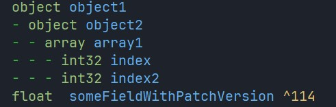

# nvim-treesitter tera-proxy definition 
This package for nvim highlight tera-proxy `def` file's according your color scheme.
WIP

# using
Put this in your polish function in `init.lua`: 
```lua
local parser_config = require "nvim-treesitter.parsers".get_parser_configs()

parser_config.teraonline_definitions = {
  install_info = {
		-- local path or git repo
    url = "https://github.com/michaelcarno/nvim-treesitter-teraproxy-definition", 
    files = { "src/parser.c" },                            
    -- optional entries:
    branch = "main",                                    
    generate_requires_npm = true,                      
    requires_generate_from_grammar = true,            
  },
  filetype = "def",                            
}
```
Sample of highlight:



